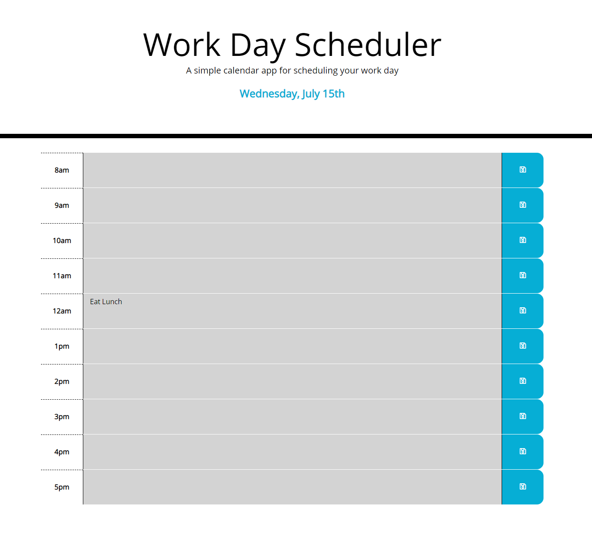

# Work Day Scheduler



## Given prompt and User Story
Create a simple calendar application that allows the user to save events for each hour of the day. This app will run in the browser and feature dynamically updated HTML and CSS powered by jQuery.

```
AS AN employee with a busy schedule
I WANT to add important events to a daily planner
SO THAT I can manage my time effectively
```

## Acceptance Criteria

```
GIVEN I am using a daily planner to create a schedule
WHEN I open the planner
THEN the current day is displayed at the top of the calendar
WHEN I scroll down
THEN I am presented with timeblocks for standard business hours
WHEN I view the timeblocks for that day
THEN each timeblock is color coded to indicate whether it is in the past, present, or future
WHEN I click into a timeblock
THEN I can enter an event
WHEN I click the save button for that timeblock
THEN the text for that event is saved in local storage
WHEN I refresh the page
THEN the saved events persist
```

The following animation demonstrates the application functionality:


## Approach to given scenario.
1. Use Moment.js to gather date info from browser and parse into usable format. 
2. Create variables with current date and current hour. 
    - Using jQuery add current date variable to text of div with id of currentDay.
    - Current hour variable to be used later to create function that colors rows. 
3. Check to see if local storage for list items is present. 
    - If not populate blank time blocks for work hours. 
    - If local storage exist populate time blocks and add existing info. 
    - Added a little reminder to eat lunch. 
4. Create for loop that cycles through time slots from 8am - 5pm.
    - Create div for main Row container first then separate divs for each of the (3) sections.
    - Created function to call that assigned AM and PM correctly according to time. 
    - Added this text to time slots.
    - Add text from local storage to description area.
    - Add save icon from font awesome into save area.
    - Add function to color time blocks according to wether or not they are in past or present.
    - Append each row to main container div. 
5. Add click-event to save-button to save typed data into local storage for that time slot. 
    - Add call to regenerate rows.  

